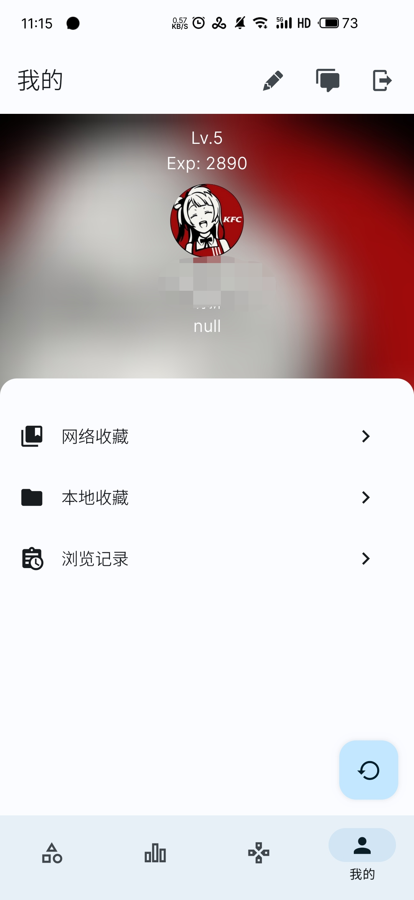
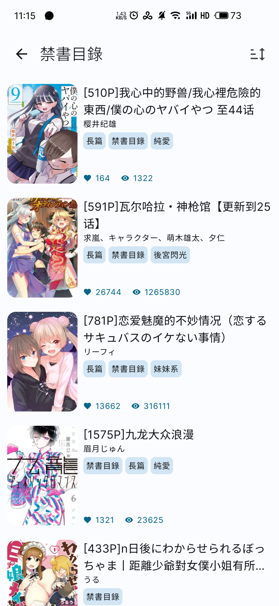
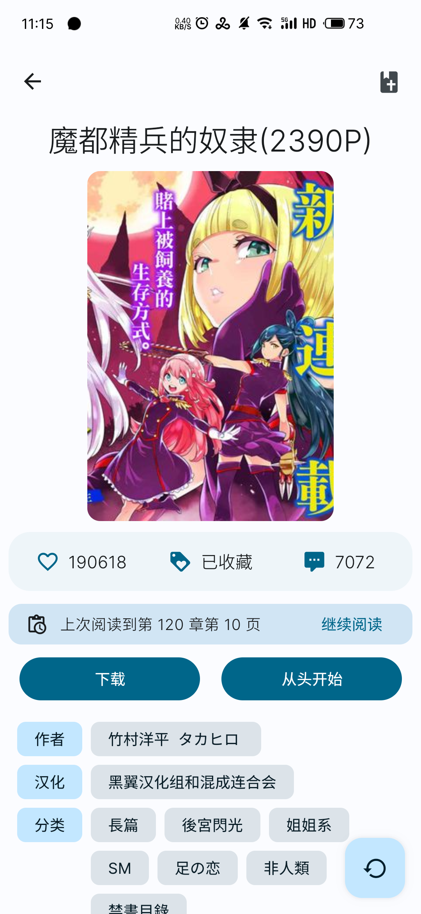
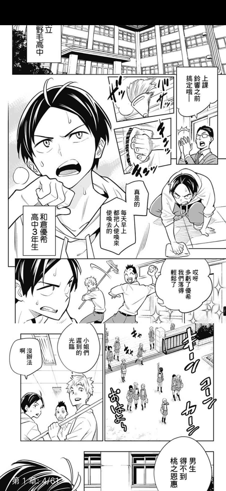

# RpicAcg
一个使用react-native做的第三方哔咔客户端

## 关于 App
刚学的一手散装RN（代码非常烂，我自己都看不下去），准备练习的时候刚好看到了，[https://github.com/wgh136/PicaComic]https://github.com/wgh136/PicaComic 跟[https://github.com/youniaogu/MangaReader]https://github.com/youniaogu/MangaReader 这两个项目，于是就仿造写了这个项目，因为没有ios设备，无法对ios进行调试，所以只发布了apk。还有许多功能没有完成，还在完成当中。非常欢迎大佬指导一下或者提提Issues（能给个Star最好了）

### 部分界面UI仿造大佬的这个项目

## 屏幕截图

